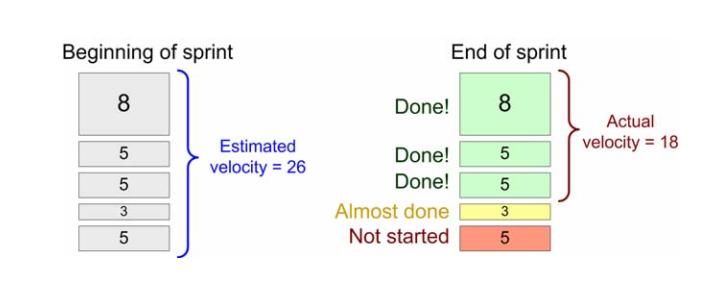

# 敏捷开发
> 天下武功无坚不摧，为快不破 ---- 李小龙

社会发展到今天，我们的科技日新月异，产品生命周期，较之过去，大大的缩短。此前如瀑布流等软件开发模式，已经很难适应大部分互联网开发产品。在这样的时代环境下，敏捷开发孕育而生，诞生出一批优秀的理论及框架(framework)。其中最为著名的尤属Scrum和Extreme Programming(极限编程，或称xp)

## Scrum

### Scrum概述

在Scrum开发中，有两个概念尤为重要。

backlog
> 制定功能目标，具体实现哪些功能

sprint及会议
> 一个生命周期内sprint的具体实现计划

参与Scrum整个开发计划的人员主要包括产品负责人和开发人员

### backlog条目
> 你才不是一个没有故事的女同学 ---- 董小姐

backlog的每一个条目都是一个业务需求，由产品负责人主要负责。因为我们更希望产品负责人将注意力放在业务层面上，而不要过多受到技术层面的制约，所以对于任何一个backlog条目，我们都应该将其停留在业务层面上，而不是讨论它的具体实施细节。例如一个开发提出需要给某张表添加一个索引，产品负责人就应该问这样添加会给我们的用户带来什么，直到我们发现一个真正的业务目标为止，例如可以让我们的搜索功能更快。

下面是一个backlog表的字段参考

主要字段

* ID 唯一标识
* Name 条目名
* Importance 重要性
* Initail estimate(Miniumn unit: story point) 预估开销
* How to demo
* Notes 注意事项

示例:

| ID | Name | Imp | Est | How to demo | Notes |
|:---:|:---:|:---:|:---:|:---:|:---:|
|1|存款|30|5|登录，打开存款界面，存入10欧元，查看余额增加10欧元|需要UML顺序图，目前不考虑增加密码问题|

其中后四个字段需要在这里解释说明一下

#### Importance
重要性在这里，仅仅是为了进行sprint的排序使用，例如其中一个条目的重要性为10，另一个为50。这并不表示后者比前者重要5倍，中间留有空隙，仅仅是为了方便如果有新的条目需要加入时，恰好他的重要程度在刚才提到的两个条目之间。这样我们可以更容易的将其插入两者之间。

#### Initail Estimate
预估开销并不是在条目创建时由产品负责人进行填写，而是在sprint会议中，由开发团队进行评估来填写。其中有一个概念需要在这里进行说明————故事点。
> 故事点是预估开销的最小单位，即每个开发人员在每天不考虑任何干扰可以开发的工作量

#### How to demo
功能演示是这个条目中非常重要的一项，这里具体说明了功能具体能达到什么效果，功能实现后具体用户可以做什么。这里也为之后测试的进行，提供了具体的操作方向。这一块的具体实施，可由产品负责人主导并参考测试人员意见进行。

#### Notes
这里主要是一些注意事项的记录，主要记录一些与主体业务无关的添加事项或减少事项。其中一个非常重要的功能就是在预估时间进行调整时，如果有功能上的调整，需要在这里进行说明。例如为了能够在这个sprint生命周期完成某个条目，可能需要减少一些预估时间，在这里就不得不减少一些功能实现，就需要在这里进行记录

参考字段

* Track(类别) 例如优化，或者bug
* Components 例如web端，Ios或者安卓等
* Requestor 负责人
* Bug tracking ID 

### sprint及会议流程
> 实践是检验真理的唯一标准

Sprint是Scrum中最重要的活动，因为只有真正进入sprint的backlog条目才是能够具体实现的条目。它具有以下几个特点

1. 时间周期固定

> 这里指每个sprint周期是固定，如果需要调整，最好是实行多次之后再进行调整。一般公司实践结果是大概3周左右是比较合适的。sprint长度定在三周比较合适，可先实行，再根据实际情况进行调整。

2. backlog评估需要

> backlog条目在评估是需要拆分成任务进行估算。比如需要哪几个页面，需要那几个接口等

3. 参与者特权

> * 添加重要性是**产品负责人**的特权
> * 评估工作时间是**开发人员**的特权

#### sprint 会议流程

参加人员

* 产品负责人
* 开发团队负责人

会议流程

1. 概括sprint达成的目标及认为重要的条目(产品负责人）
2. 逐一讨论条目及一一估算时间，讨论具体条目细节
3. 产品负责人和开发团队可以根据开发时间及重要性重新进行调整
4. 确定跟进项目进度的会议安排

注：

1. 所有sprint需要完成的条目，都需要将重要性调到最前面
2. 如果sprint会议在预定时间没有结束，会选择在第二天继续召开

会议目的

* sprint 目标
* sprint期间需要完成的backlog
* 执行sprint团队成员名单
* sprint 演示日期(dead line)
* scrum会议 (时间地点)

因为实际开发中，开发人员会有被打断的情况，所以我们最终的生产率并不是按照实打实的故事点进行计算，而是使用生产率。第一次我们按照100%的投入计算，之后根据完成情况在进行估算。这个方法叫yesterday's weather

生产率 = 故事点 × 投入程度 
投入程度越小，表示受干扰程度越大。（一个健康的投入程度大概是70%左右）

backlog条目完成一般以测试人员测试通过为准，因为对于敏捷开发来说，应该做到随时向上线，随时都可以上线

最后scrum开发框架其实是一种习惯，只有大家都已经习惯了这种开发流程，才能发挥它的最大价值。

## Extreme Programming

## Tool
* VersionOne
* ScrumWorks
* Xplanner