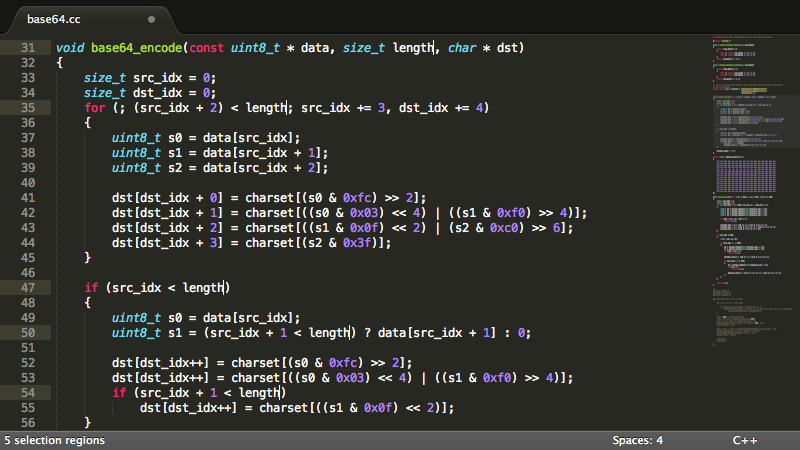
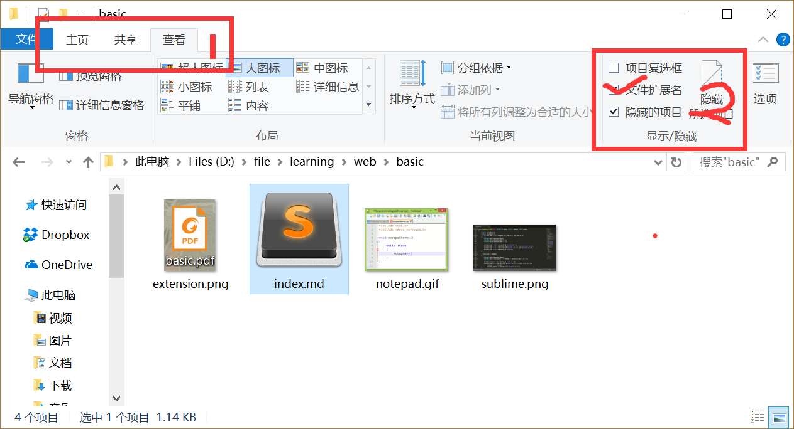
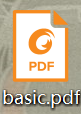

# Web开发基础篇
> 合抱之木，生于毫末；九层之台，起于累土；千里之行，始于足下 -- 《老子》

## 预备工作
> 工欲善其事，必先利其器 -- 《论语》

在进行学习之前，有一个好的开发环境，会对我们学习编程有很大的帮助。下面的内容将为大家介绍一些好的开发工具和必要的环境配置。只有这样，才能让大家的学习轻松愉快，并且事半功倍。

### 安装工具
对于入门学习，我主要推荐以下两个编辑器[^1]和Chrome浏览器，来帮助大家完成学习。以下编辑器，只需要安装一个即可。

1. [sublime](http://www.sublimetext.com/)  
   
2. [notepad++](https://notepad-plus-plus.org/)  
   

### 环境配置
编辑器和浏览器就绪后，需要查看您的电脑是否可以查看文件的后缀名[^2]。如果已经可以查看，请跳过下面的配置。我们以win10为例：

进入任一文件夹，我们可以看见如下图环境：

先按步骤1点击查看，在按步骤2勾选文件扩展名。这样你就可以查看到文件的后缀名了^_^

## HTML基础

现在我们要正式开始踏上我们的征途了，首先我们要学习的是HTML。我们先创建一个`index.html`文件，可以直接右键创建文本文件，然后将文件名改成`index.html`。随后，用我们之前的编辑器[^3]打开。在里面写下以下内容：

```html
<html>
<body>

<h1>我的第一个标题</h1>

<p>我的第一个段落</p>

</body>
</html>
```

然后用浏览器打开这个页面，你将得到你的第一个html程序。

之后你可以登录[HTML](http://www.w3school.com.cn/html/html_basic.asp)和[CSS](http://www.w3school.com.cn/css/index.asp)，继续学习。以下是学习章节推荐：

必修：
1. HTML基础教程
2. HTML表单
3. HTML5
4. CSS基础教程
5. CSS样式
6. CSS框模型
7. CSS定位

选修：
1. HTML图形
2. HTML媒体
3. CSS选择器
4. CSS高级

[^1]: 编辑器只是普通的记事本，主要是提供代码的颜色渲染功能，并没有什么特别之处。
[^2]: ，点后面的**pdf**部分即为后缀名
[^3]: sublime 或者 notepad++


