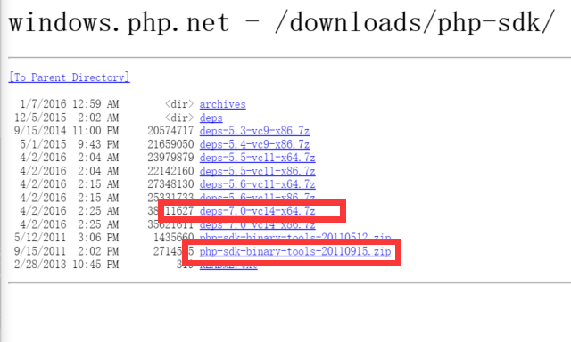

# PHP
该文档包含PHP的代码规范，编码技巧和使用说明

---

[TOC]

## php书写规范(PSR1,PSR2以及PSR4)
### 源文件
- 源文件必须只使用**不带bom的UTF-8编码**
- 源文件必须使用**Unix LF(linefeed)**换行。
- 一行的末尾必须不能有空格
- 代码必须使用**4个空格(whitespace)**而不是制表符(tab)进行缩进
- 源文件必须只使用`<?php`和`<?=`这两种标签。
- 源文件必须在结尾使用一个空行且若该文件只有php代码，可以忽略`?>`
- 一行不可多于一句语句(statement)
- 源文件建议只用来声明或者做一些副作用的操作(如:输出信息，修改.ini配置)
- 一行代码长度建议不超过80个字符，最好不超过120个字符

### 命名空间
- 命名空间(namespace)和类命名必须遵从[PSR-4](https://github.com/php-fig/fig-standards/blob/master/accepted/PSR-4-autoloader-examples.md)

`\<NamespaceName>(\<SubNamespaceNames>)*\<ClassName>`

- 命名空间(namespace)后必须有一个空行
- 所有的导入(use)声明必须在命名空间(namespace)之后，在导入(use)后面也必须有一个空行

```php
<?php
namespace Vendor\Package;

use FooClass;
use BarClass as Bar;
use OtherVendor\OtherPackage\BazClass;

// ... additional PHP code ...
```

### 类,继承和实现
- 类(class)的开闭括号都必须单独成行
- 继承(extends)和实现(implements)关键字必须和类名(class name)声明在同一行
- 如果接口数量较多，则每个接口单独成行。

```php
<?php
namespace Vendor\Package;

use FooClass;
use BarClass as Bar;
use OtherVendor\OtherPackage\BazClass;

class ClassName extends ParentClass implements \ArrayAccess, \Countable
{
    // constants, properties, methods
}
```

```php
<?php
namespace Vendor\Package;

use FooClass;
use BarClass as Bar;
use OtherVendor\OtherPackage\BazClass;

class ClassName extends ParentClass implements
    \ArrayAccess,
    \Countable,
    \Serializable
{
    // constants, properties, methods
}
```

### 属性
- 类常量(Class constants)必须使用全部**大写字母(upper case)**声明,
- 关键字(keywords)必须使用全部**小写字母(lower case)**声明

```php
<?php
namespace Vendor\Model;

class Foo
{
    const VERSION = '1.0';
    const DATE_APPROVED = '2012-06-01';
    public $bool = true;
}
```
- 属性(properties)可以使用StudlyCaps[^studlyCaps],camelCase,under\_score中的一种，但是在某个范围内需要保持一致。推荐使用under\_score
- 可见性(Visibility)必须所有属性都声明，一个语句(statement)只能声明一个变量，且不再使用`var`声明变量。
- 变量不应使用前置下划线来显示是否为保护(protected)或私有(private)变量

```php
<?php
namespace Vendor\Package;

class ClassName
{
    public $foo = null;
}
```

### 方法
- 方法(methods)必须使用camelCase
- 可见性(Visibility)必须所有方法(methods)都声明
- 方法(methods)不应使用前置下划线来显示是否为保护(protected)或私有(private)方法
- 方法(methods)的开闭括号(brace)必须独占一行

```php
<?php
namespace Vendor\Package;

class ClassName
{
    public function fooBarBaz($arg1, &$arg2, $arg3 = [])
    {
        // method body
    }
}
```

- 参数列表(argument list)中，逗号(comma)前面不能使用空格，但是后面必须跟一个空格
- 带有默认值的参数(method arguments)必须放在参数列表尾。

```php
<?php
namespace Vendor\Package;

class ClassName
{
    public function foo($arg1, &$arg2, $arg3 = [])
    {
        // method body
    }
}
```

- 如果变量列表(argument list)写在多行，需要有缩进一格，第一个变量需要放在括号的下一行，且每行只能放一个参数。
- 右小括号(closing parenthesis)和做大括号(opening brace)必须放在一行，且中间空一格

```php
<?php
namespace Vendor\Package;

class ClassName
{
    public function aVeryLongMethodName(
        ClassTypeHint $arg1,
        &$arg2,
        array $arg3 = []
    ) {
        // method body
    }
}
```

- 函数调用时，括号(parenthesis)左右不可有空格，参数列表(argument list)中，逗号之前不可有空格，之后必须有空格
- 调用函数，当参数需要写在多行时，参数需要缩进一格，第一个变量需放在括号的下一行，且每一行只能有一个参数。

```php
<?php
bar();
$foo->bar($arg1);
Foo::bar($arg2, $arg3);

$foo->bar(
    $longArgument,
    $longerArgument,
    $muchLongerArgument
);

somefunction($foo, $bar, [
  // ...
], $baz);

$app->get('/hello/{name}', function ($name) use ($app) { 
    return 'Hello '.$app->escape($name); 
});
```

### 修饰符
- `abstract`和`final`必须在可见性(visibility)之前声明
- `static`必须在可见性(visibility)之后声明

```php
<?php
namespace Vendor\Package;

abstract class ClassName
{
    protected static $foo;

    abstract protected function zim();

    final public static function bar()
    {
        // method body
    }
}
```

### 结构体(control structures)
- 结构体关键字后必须有一个空格(space)
- 左括号(opening parenthesis)后面不可以有空格(space)
- 右括号(closing parenthesis)前面不可以有空格(space)
- 右括号(closing parenthesis)和左大括号(opening brace)之间必须有一个空格(space)
- 结构体(structure body)必须缩进一格(be indented once)
- 右大括号(closing brace)必须在结构体后另起一行
- 结构体必须被大括号(brace)包围
- if语句标准写法如下，`elseif`应该被用来替代`else if`

```php
<?php
if ($expr1) {
    // if body
} elseif ($expr2) {
    // elseif body
} else {
    // else body;
}
```

- switch语句标准写法如下，当`break`在`case`语句中有意落空时，需要添加注释`//no break`

```php
<?php
switch ($expr) {
    case 0:
        echo 'First case, with a break';
        break;
    case 1:
        echo 'Second case, which falls through';
        // no break
    case 2:
    case 3:
    case 4:
        echo 'Third case, return instead of break';
        return;
    default:
        echo 'Default case';
        break;
}
```

- while, do while, for, foreach语句标准写法如下

```php
<?php
// while
while ($expr) {
    // structure body
}
// do while
do {
    // structure body;
} while ($expr);
// for
for ($i = 0; $i < 10; $i++) {
    // for body
}
// foreach
foreach ($iterable as $key => $value) {
    // foreach body
}
```

- try, catch语句标准如下

```php
<?php
try {
    // try body
} catch (FirstExceptionType $e) {
    // catch body
} catch (OtherExceptionType $e) {
    // catch body
}
```
### 闭包(Closures)
- function之后，use前后都需要有一个空格
- 左大括号(opening brace)需要跟function在同一行,右大括号(closing brace)必须单独成行
- 小括号规则和参数列表规则与一般函数相同

```php
<?php
$closureWithArgs = function ($arg1, $arg2) {
    // body
};

$closureWithArgsAndVars = function ($arg1, $arg2) use ($var1, $var2) {
    // body
};

$longArgs_noVars = function (
    $longArgument,
    $longerArgument,
    $muchLongerArgument
) {
   // body
};

$noArgs_longVars = function () use (
    $longVar1,
    $longerVar2,
    $muchLongerVar3
) {
   // body
};

$longArgs_longVars = function (
    $longArgument,
    $longerArgument,
    $muchLongerArgument
) use (
    $longVar1,
    $longerVar2,
    $muchLongerVar3
) {
   // body
};

$longArgs_shortVars = function (
    $longArgument,
    $longerArgument,
    $muchLongerArgument
) use ($var1) {
   // body
};

$shortArgs_longVars = function ($arg) use (
    $longVar1,
    $longerVar2,
    $muchLongerVar3
) {
   // body
};
```

- 这个规则在闭包作为参数时一样适用

```php
<?php
$foo->bar(
    $arg1,
    function ($arg2) use ($var1) {
        // body
    },
    $arg3
);
```

## php编译安装扩展
### linux下安装:
```shell
#下载插件
#解压
#进入插件文件夹
phpize
./configure --with-php-config=php-config #php-config为php配置文件所在
make && make install
vim php.ini #添加扩展至php.ini文件
```
### windwos下安装:

- [需要安装visual studio](https://www.visualstudio.com/zh-cn/downloads/download-visual-studio-vs.aspx)
- 需要C扩展源码
- [需要php源码](http://windows.php.net/download#php-7.0)  

- [需要php sdk,deps](http://windows.php.net/downloads/php-sdk/)  



>解压源码，创建pecl文件夹，将C扩展源码复制进去  
>使用vc初始化命令行界面  
>  

```cmd  
cd php-sdk-binary-tools-version\bin ::version为版本号  
phpsdk_buildtree.bat php-dev ::php-dev为文件夹名
phpsdk_setvars.bat
cd php-dev
rename vc9 vc14
cd vc14\x64 ::如果为32位操作系统，则进入x86
```

将x64中的内容替换成下载的deps及源码  


```cmd
cd src
buildconf
::下面的配置是以php-redis扩展为例
configure --disable-all --enable-zts --with-analyzer --with-all-shared --enable-cgi --enable-session --enable-redis=shared --enable-redis=session --enable-redis-igbinary
nmake php_redis.dll
```
得到需要的php_redis.dll文件

pgo编译优化

```cmd
configure --disable-all --enable-zts --enable-pgi --with-analyzer --with-all-shared --enable-cli --enable-session --enable-redis=shared --enable-redis-session --enable-redis-igbinary
nmake php_redis.dll
```
将php_redis.dll复制到ext目录下,并将pgort140.dll[^pgo]复制到与php.exe同一目录下  
使用php运行TestRedis.php文件，可以在ext中得到pgc文件，删除后在运行一次TestRedis.  
将再次获得的pgc文件放入编译目录

```cmd
nmake clean-pgo
configure --disable-all --enable-zts --with-pgo --with-analyzer --with-all-shared --enable-cli --enable-session --enable-redis=shared --enable-redis-session --enable-redis-igbinary 
nmake php_redis.dll
```
得到优化后的php_redis.dll文件

下面是pthreads的配置文件:

```cmd
configure --disable-all --enable-zts --enable-pgi --with-analyzer --with-all-shared --enable-cli --enable-session --with-pthreads=shared

configure --disable-all --enable-zts --with-pgo --with-analyzer --with-all-shared --enable-cli --enable-session --with-pthreads=shared
```

## php技巧
### 树展示
```php
<?php
function generateTree($items)
{
    $tree = [];
    foreach ($items as $item) {
        if (isset($items[$item['pid']])) {
            $items[$item['pid']]['son'][] = &$items[$item['pid']];
        } else {
            $tree[] = &$items[$item['pid']];
        }
    }
    return tree;
}
// 改进算法
function generateTree($items)
{
    foreach ($items as $item) {
        $items[$item['pid']]['son'][$item['id']] = &$items[$item['pid']];
    }
    return $items[0]['son'] ?? [];
}
```

[^pgo]: pgor140.dll一般在vs目录下VC\bin之中
[^studlyCaps]: StudlyCaps是一种单词中字母随机或按某些规律大小写混排的风格。其中比较有名的是PascalCase和camelCase。（为了不产生歧义，直立指代PascalCase）