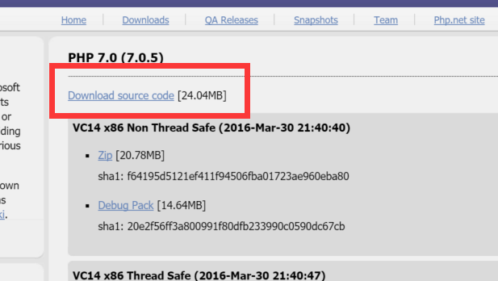
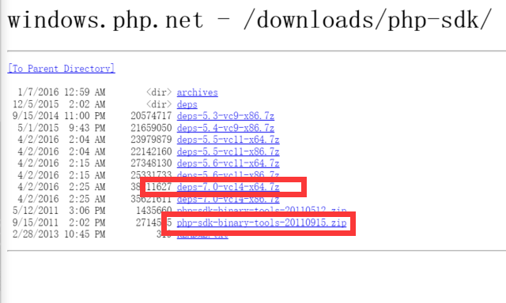
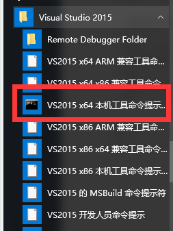
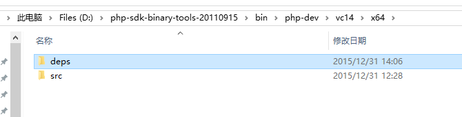

# PHP 扩展

## php编译安装扩展

### linux下安装:

```shell
#下载插件
#解压
#进入插件文件夹
phpize
./configure --with-php-config=php-config #php-config为php配置文件所在
make && make install
vim php.ini #添加扩展至php.ini文件
```

### windwos下安装:

- [需要安装visual studio](https://www.visualstudio.com/zh-cn/downloads/download-visual-studio-vs.aspx)
- 需要C扩展源码
- [需要php源码](http://windows.php.net/download#php-7.0)  

- [需要php sdk,deps](http://windows.php.net/downloads/php-sdk/)  



>解压源码，创建pecl文件夹，将C扩展源码复制进去  
>使用vc初始化命令行界面  
>  

```cmd  
cd php-sdk-binary-tools-version\bin ::version为版本号  
phpsdk_buildtree.bat php-dev ::php-dev为文件夹名
phpsdk_setvars.bat
cd php-dev
rename vc9 vc14
cd vc14\x64 ::如果为32位操作系统，则进入x86
```

将x64中的内容替换成下载的deps及源码  


```cmd
cd src
buildconf
::下面的配置是以php-redis扩展为例
configure --disable-all --enable-zts --with-analyzer --with-all-shared --enable-cgi --enable-session --enable-redis=shared --enable-redis=session --enable-redis-igbinary
nmake php_redis.dll
```
得到需要的php_redis.dll文件

pgo编译优化

```cmd
configure --disable-all --enable-zts --enable-pgi --with-analyzer --with-all-shared --enable-cli --enable-session --enable-redis=shared --enable-redis-session --enable-redis-igbinary
nmake php_redis.dll
```
将php_redis.dll复制到ext目录下,并将pgort140.dll[^pgo]复制到与php.exe同一目录下  
使用php运行TestRedis.php文件，可以在ext中得到pgc文件，删除后在运行一次TestRedis.  
将再次获得的pgc文件放入编译目录

```cmd
nmake clean-pgo
configure --disable-all --enable-zts --with-pgo --with-analyzer --with-all-shared --enable-cli --enable-session --enable-redis=shared --enable-redis-session --enable-redis-igbinary 
nmake php_redis.dll
```
得到优化后的php_redis.dll文件

下面是pthreads的配置文件:

```cmd
configure --disable-all --enable-zts --enable-pgi --with-analyzer --with-all-shared --enable-cli --enable-session --with-pthreads=shared

configure --disable-all --enable-zts --with-pgo --with-analyzer --with-all-shared --enable-cli --enable-session --with-pthreads=shared
```

[^pgo]: pgor140.dll一般在vs目录下VC\bin之中
