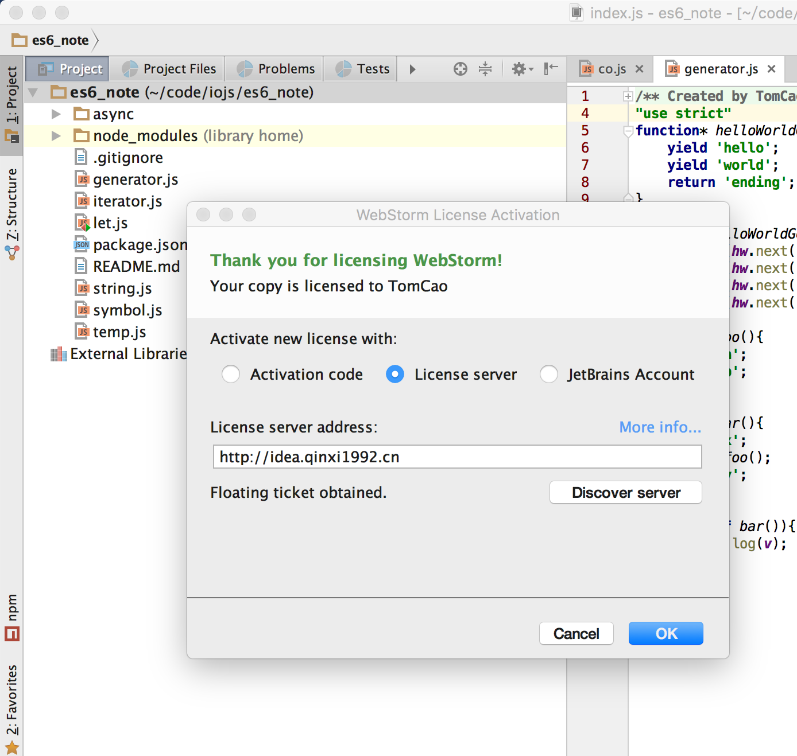

# 软件crack
该文档包含常用软件的破解方法

---

[TOC]

### [JetBrains][jetbrains]
该公司旗下的webstorm,phpstorm等集成开发环境(IDE),都可以使用以下方法破解:  
  
输入<http://idea.qinxi1992.cn>回车即可

### [Sublime text3][sublime text3]
sublime text3的破解方法可直接使用[注册码][sublime license]:

> —– BEGIN LICENSE —–  
> Michael Barnes  
> Single User License  
> EA7E-821385  
> 8A353C41 872A0D5C DF9B2950 AFF6F667  
> C458EA6D 8EA3C286 98D1D650 131A97AB  
> AA919AEC EF20E143 B361B1E7 4C8B7F04  
> B085E65E 2F5F5360 8489D422 FB8FC1AA  
> 93F6323C FD7F7544 3F39C318 D95E6480  
> FCCC7561 8A4A1741 68FA4223 ADCEDE07  
> 200C25BE DBBC4855 C4CFB774 C5EC138C  
> 0FEC1CEF D9DCECEC D3A5DAD1 01316C36  
> —— END LICENSE ——

<!-- link -->
[jetbrains]:https://www.jetbrains.com/
[sublime text3]:http://www.sublimetext.com/3
[sublime license]:http://www.jianshu.com/p/04e1b65dd2c0

