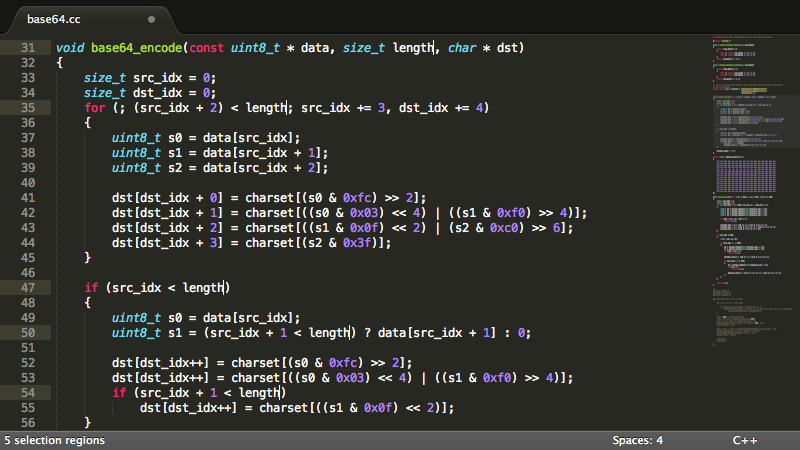
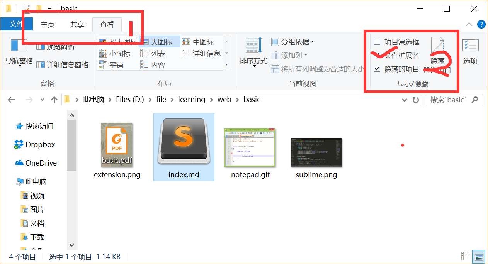

# Web开发基础篇
> 合抱之木，生于毫末；九层之台，起于累土；千里之行，始于足下 -- 《老子》

## 预备工作
> 工欲善其事，必先利其器 -- 《论语》

在进行学习之前，有一个好的开发环境，会对我们学习编程有很大的帮助。下面的内容将为大家介绍一些好的开发工具和必要的环境配置。只有这样，才能让大家的学习轻松愉快，并且事半功倍。

### 安装工具
对于入门学习，我主要推荐以下两个编辑器[^1]和Chrome浏览器，来帮助大家完成学习。以下编辑器，只需要安装一个即可。

1. [sublime](http://www.sublimetext.com/)  
   
2. [notepad++](https://notepad-plus-plus.org/)  
   

### 环境配置
编辑器和浏览器就绪后，需要查看您的电脑是否可以查看文件的后缀名[^2]。如果已经可以查看，请跳过下面的配置。我们以win10为例：

进入任一文件夹，我们可以看见如下图环境：

先按步骤1点击查看，在按步骤2勾选文件扩展名。这样你就可以查看到文件的后缀名了^_^

## HTML基础

[^1]: 编辑器只是普通的记事本，主要是提供代码的颜色渲染功能，并没有什么特别之处。
[^2]: ，点后面的**pdf**部分即为后缀名

